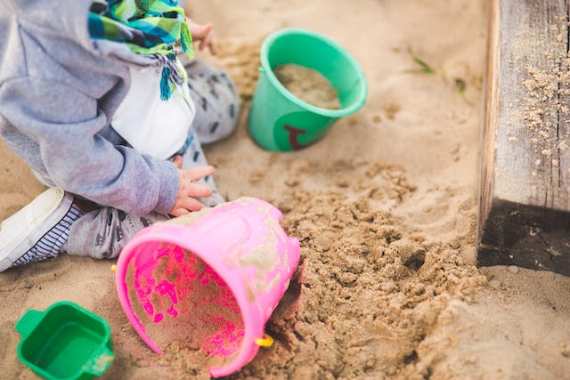

# Developer's Coding Sandbox Drupal Module



**Only enable this module in development environments!**

## Summary

Provides a means of routing the Drupal kernel to a controller file anytime `?sb=1` is appended to the current URL. This allows you to quickly test out code in a Drupal-bootstrapped, sandbox environment. It makes for fast development.

The controller file should be located at _web/../dev_sandbox.inc_.

```text
.
└── app
    ├── dev_sandbox.inc
    └── web
```

## Install with Composer

Because this is an unpublished, custom Drupal module, the way you install and depend on it is a little different than published, contributed modules.

* Add the following to the **root-level** _composer.json_ in the `repositories` array:
    ```json
    {
     "type": "github",
     "url": "https://github.com/aklump/drupal_dev_sandbox"
    }
    ```
* Add the installed directory to **root-level** _.gitignore_
  
   ```php
   /web/modules/custom/dev_sandbox/
   ```
* Proceed to either A or B, but not both.
---
### A. Install Standalone
* Require _dev_sandbox_ at the **root-level**.
    ```
    composer require --dev aklump_drupal/dev_sandbox:^0.0
    ```
---
### B. Depend on This Module

(_Replace `my_module` below with your module (or theme's) real name._)

* Add the following to _my_module/composer.json_ in the `repositories` array. (_Yes, this is done both here and at the root-level._)
    ```json
    {
     "type": "github",
     "url": "https://github.com/aklump/drupal_dev_sandbox"
    }
    ```
* From the depending module (or theme) directory run:
    ```
    composer require --dev aklump_drupal/dev_sandbox:^0.0 --no-update
    ```

* Add the following to _my_module.info.yml_ in the `dependencies` array:
    ```yaml
    aklump_drupal:dev_sandbox
    ```
* Back at the **root-level** run `composer update vendor/my_module`


---
### Enable This Module

* Re-build Drupal caches, if necessary.
* Enable this module, e.g.,
  ```shell
  drush pm-enable dev_sandbox
  ```

1. Create controller, e.g. `touch dev_sandbox.inc` in the directory above web root.
2. Add _dev\_sandbox.inc_ to _.gitignore_ as well.
3. @see `\Drupal\dev_sandbox\EventSubscriber\Sandbox::getSandboxPath` for more info.

## Usage

1. Add some code to _dev\_sandbox.inc_.

      ```php
      <?php
      print \Drupal::config('system.site')->get('name');
      ```   
1. Add `?sb=1` to the url and refresh the page; if you view source will see something like:

      ```text
      <!-- DEV SANDBOX DEBUG -->
      <!-- BEGIN OUTPUT from '/app/dev_sandbox.inc' -->
      My Project
      ```
1. To set the active theme, you should also add `theme={theme_name}` in the URL.
